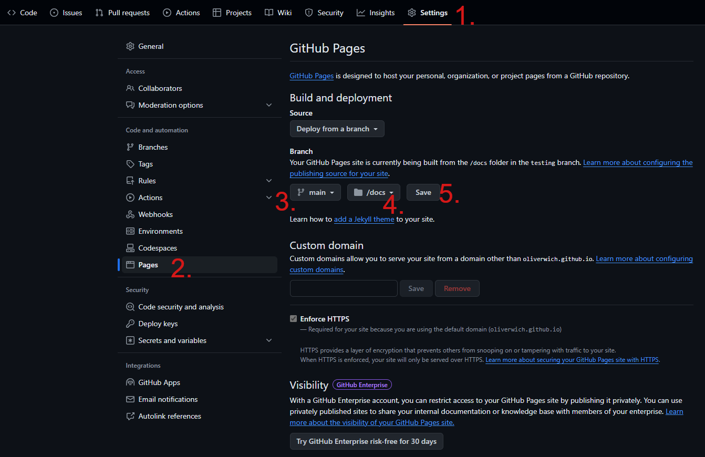

# Aufgabe 1 - Packt die Gabeln aus

Mit dieser Aufgabe bereitet ihr eine Website vor, auf die später aufgebaut wird und welche in eine PWA verwandelt wird.
Diese Seite wird auf GitHub Pages gehostet.

## Aufgabenstellung

1. Forkt dieses Repository (nur den `main` Branch)
2. Kopiert den Inhalt des Ordners `Aufgabe_1` in den Ordner `docs` und pusht das Ganze.
3. Geht in die Einstellungen und aktiviert GitHub Pages
4. Stellt Pages so ein, der Ordner `docs` als Quelle für die Pages verwendet wird.

### GitHub Pages walkthrough

## Ziel

Wenn alles gut läuft, habt ihr danach eine gehostete Seite auf der wir später aufbauen können! 
