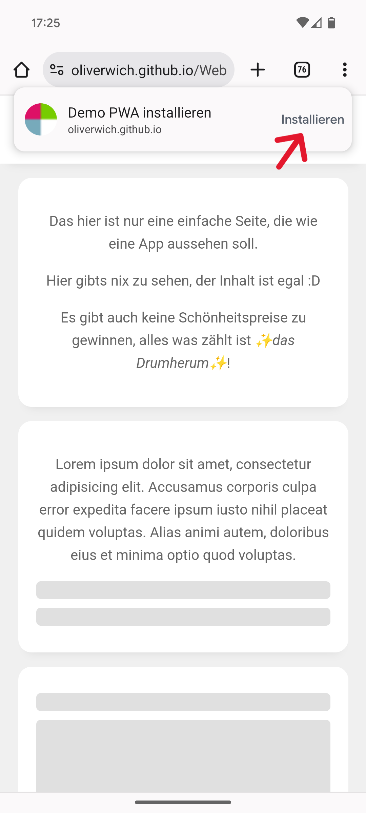
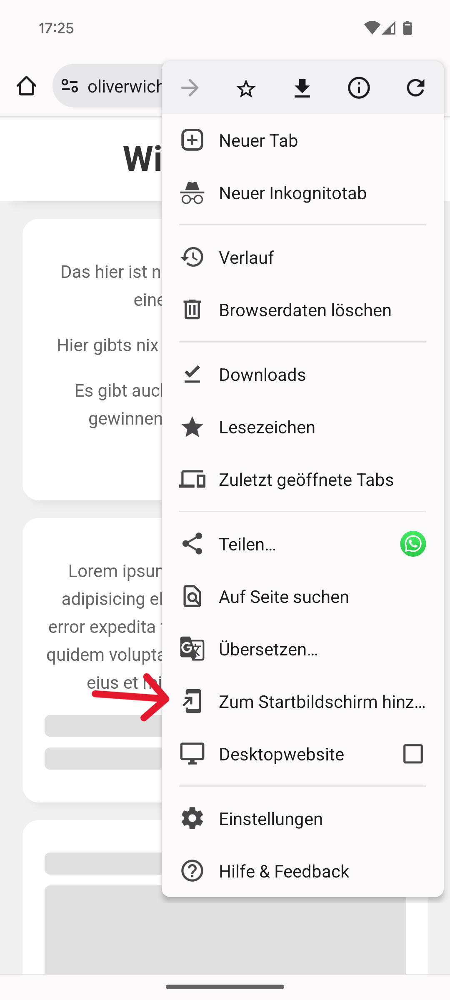
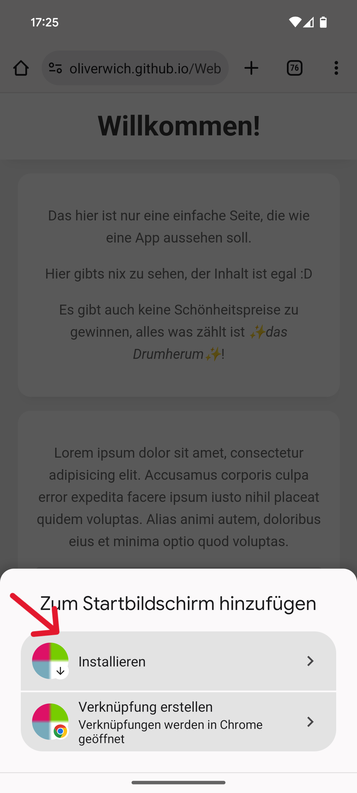

# Aufgabe 2 - Web-App

In dieser Aufgabe erstellt ihr ein Webmanifest welches eure Website für den Browser als App kennzeichnet.
Noch sind wir aber noch nicht bei einer PWA, sondern erst bei einer Web-App.

## Aufgabenstellung

1. Kopiert den Inhalt des Ordners `Aufgabe_2` in den Ordner `docs`.
2. Benennt die Datei `manifest.json5` in `manifest.json` um und entfernt die Kommentare.
3. Befüllt die Placeholder im Manifest mit euren Daten
4. Registriert das Manifest in eurer `index.html` Datei als Link mit dem `rel`-Attribut `manifest`
5. Pusht das Ganze
6. Installiert die Anwendung auf eurem Smartphone

> Bonus: Manifest generieren lassen mit ggf. eigenem Icon
> 
> Nutzt ein Tool wie https://progressier.com/pwa-manifest-generator, um euch das Manifest generieren zu lassen.
> Dadurch könnt ihr auch ein eigenes Icon wählen, welches automatisch passend formatiert wird.

> Bonus 2: Rich Install UI (Setzt Chrome Android voraus)
> 
> Fügt ihr mindestens einen Screenshot der App hinzu und registriert diesen im Manifest.
> Setzt dabei `form_factor` auf "narrow" für einen Screenshot im Portrait-Modus und auf "wide" für einen Screenshot im Landscape-Modus.
> Weitere Details und eine genaue Anleitung findet ihr unter https://web.dev/patterns/web-apps/richer-install-ui?hl=de

### Installations Walkthrough (Chrome Android)

#### Entweder direkt über den Banner:

#### Oder über das "Drei-Punkte-Menu":

Und dann auf "Installieren":

## Ziel

Nach dieser Aufgabe habt ihr eine Web-App, die sich auf eurem Smartphone installieren lässt und sich wie eine native App verhält.
